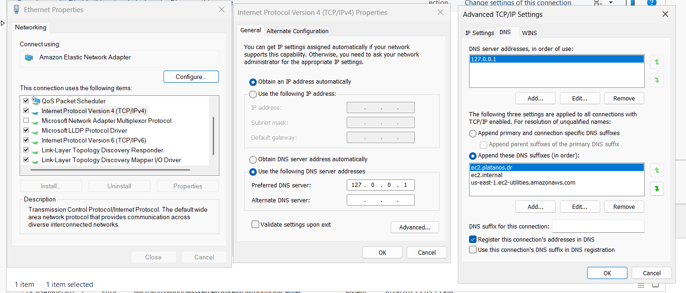

# M159
Gitlab -> https://gitlab.com/ch-tbz-it/Stud/m159/
## Aufträge
- [Einstiegsfragen](/Tasks/Einstiegsfragen.md)
- [SSO](/Tasks/sso.md)

## Bewertungsraster

| #    | Aufgabe                                                      | Beschreibung                                                 |
| ---- | ------------------------------------------------------------ | ------------------------------------------------------------ |
| 1    | [Planung](Aufträge/01_Planung)                               | Erstellen einer detaillierten Projektplanung inklusive Definition aller relevanten Parameter. |
| 2    | [Initial Setup](Aufträge/02_Initial_Setup)                   | Grundinstallation und Konfiguration der AWS-Umgebung gemäss Planung, inklusive IP-Adressen, Hostnames, Ports und Standardeinstellungen. |
| 3    | [Gesamtstruktur (erster DC) & Client](Aufträge/03_Neue_Gesamtstruktur_und_Client) | Einrichtung des ersten Domain Controllers, Join des Clients zur Domäne und Umsetzung aller definierten Zusatzanforderungen. |
| 4    | [Freigaben Laufwerke Berechtigungen](Aufträge/04_Freigaben_Laufwerke_Berechtigungen) | Anlegen der benötigten Gruppen und Benutzer, Zuweisung und Test der NTFS- und Freigabeberechtigungen sowie Umsetzung von ABE und Group-Nesting-Konzept. |
| 5    | [AWS Managed Microsoft AD](Aufträge/05_AWS Managed Microsoft AD) | Einrichtung von AWS Managed Microsoft AD, Konfiguration der Ports und Aufbau eines funktionierenden Trusts mit Sicherheitsdokumentation. |
| 6    | [RSAT & Admin Center V2](Aufträge/06_RSAT_&_Admin_Center_V2) | Installation der RSAT-Tools, Einrichtung des Windows Admin Centers für interne und externe Administration unter Berücksichtigung von Sicherheitsmassnahmen. |
| 7    | [DIT & GPO's](Aufträge/07_DIT&GPO's)                         | Erstellung einer korrekten Domänenstruktur (DIT) und Umsetzung der definierten GPO-Aufgaben gemäss Anforderungen. |
| 8    | [MS Entra ID & MS Entra Connect](Aufträge/08_MS_Entra_ID&MS_Entra_Connect) | Verbinden Sie Ihre Active-Directory-Umgebung mit Azure Entra Connect und synchronisieren Sie Objekte zwischen Active Directory und Entra ID. Führen Sie anschließend den Hybrid Join durch, damit die Clients sowohl in AD als auch in Entra ID als Geräte sichtbar sind. |
| 9    | [Servergespeicherte Benutzerprofile](Aufträge/09_Servergespeicherte_Benutzerprofile) | Einrichtung von Roaming Profiles, Folder Redirection oder FS-Logix sowie Migration von Profilordnern nach OneDrive Business. |
| 10   | [Netzlaufwerk to Azure Migration](Aufträge/10_Netzlaufwerk_to_Azure_Migration) | Einrichtung eines Azure Storage Accounts mit File Share und Anbindung über Key oder Entra ID/AD-Integration ohne zusätzliche Authentifizierung. |
| 11   | [SSO Python App](Aufträge/11_SSO_Python_App)                 | Einrichtung und Test einer Python-Webanwendung mit Single Sign-On (SSO) Integration über Entra ID und verschiedenen Authentifizierungsverfahren. |

| Feld                                | Wert |
| ----------------------------------- | ---- |
| Vorname                             |      |
| Nachname                            |      |
| Klasse                              |      |
| Dokumentation (GIT-Repository-Link) |      |

---

## 3. Ressourcen

| Feld                                                         | Wert                  |
| ------------------------------------------------------------ | --------------------- |
| Active Directory Second-Level-Domäne                         |                       |
| Geplante öffentliche Domain (UPN) -> Registrieren Sie einen Namen unter https://dynv6.com/ |                       |
| Azure Education Account mit 80$ ([Anleitung für Freischaltung mit neuer nicht TBZ-E-Mail](../../..//02_Unterrichtsressourcen/03_Fachliteratur&Tutorials/Azure/QRC_AzureForStudents.pdf)) (Wenn Sie Ihre private E-Mail-Adresse nicht verwenden möchten, können Sie beispielsweise eine Gmail-Adresse erstellen.) |                       |
| Azure Education Account Passwort                             | sdf3432lk4nsdfäö$3244 |

---

## 4. AWS VPC Setup

**Hinweis:**  
Alle Instanzen liegen in einem öffentlichen Subnetz und sind über RDP (Port 3389) von außen erreichbar.  
Alle weiteren Ports sind nur innerhalb des VPCs offen.  

| Komponente                      | VPC-ID                | CIDR        | Name |
| ------------------------------- | --------------------- | ----------- | ---- |
| VPC                             | vpc-0470f613e45697700 | 10.100.0.0/16 |      |
| M159-subnet-private1-us-east-1a |                       |             |      |
| M159-subnet-private2-us-east-1b |                       |             |      |
| M159-subnet-public1-us-east-1a  |                       |             |      |
| M159-subnet-public2-us-east-1b  |                       |             |      |

---

## 5. AWS Sicherheitsgruppen

### Sicherheitsgruppe für Domain Controller

| Regeltyp | Port(e)          | Quelle                                           |
| -------- | ---------------- | ------------------------------------------------ |
| RDP      | 3389             | 0.0.0.0                                          |
| LDAP     | 389 (TCP/UDP)    | 10.0.0.0/20  10.0.128.0/20 10.0.144.0/20 |
| LDAPS    | 636              | 10.0.0.0/20  10.0.128.0/20 10.0.144.0/20 |
| Kerberos | 88 (TCP/UDP)     | 10.0.0.0/20  10.0.128.0/20 10.0.144.0/20 |
| SMB      | 445              | 10.0.0.0/20  10.0.128.0/20 10.0.144.0/20 |
| DNS      | 53 (TCP/UDP)     | 10.0.0.0/20  10.0.128.0/20 10.0.144.0/20 |
| RPC      | 135, 49152-65535 | 10.0.0.0/20  10.0.128.0/20 10.0.144.0/20 |
| ICMP     | Alle             | 10.0.0.0/20  10.0.128.0/20 10.0.144.0/20 |

### Sicherheitsgruppe für Clients

| Regeltyp | Port(e)     | Beschreibung                             | Quelle                                           |
| -------- | ----------- | ---------------------------------------- | ------------------------------------------------ |
| RDP      | 3389        | Remote Desktop                           | 0.0.0.0                                          |
| TCP      | 88          | Kerberos Authentication                  | 10.0.0.0/20  10.0.128.0/20 10.0.144.0/20 |
| TCP      | 135         | RPC Endpoint Mapper                      | 10.0.0.0/20  10.0.128.0/20 10.0.144.0/20 |
| TCP      | 139         | NetBIOS Session Service                  | 10.0.0.0/20  10.0.128.0/20 10.0.144.0/20 |
| TCP      | 389         | LDAP                                     | 10.0.0.0/20  10.0.128.0/20 10.0.144.0/20 |
| UDP      | 53          | DNS                                      | 10.0.0.0/20  10.0.128.0/20 10.0.144.0/20 |
| TCP      | 445         | SMB/CIFS (Dateifreigabe, AD-Operationen) | 10.0.0.0/20  10.0.128.0/20 10.0.144.0/20 |
| TCP      | 49152-65535 | RPC Ephemeral Ports                      | 10.0.0.0/20  10.0.128.0/20 10.0.144.0/20 |
| ICMP     | Alle        | Ping etc.                                | 10.0.0.0/20  10.0.128.0/20 10.0.144.0/20 |

---

## 6. Active Directory Umgebung

### On-Premises Active Directory (AWS EC2)

| Feld                                  | Wert                  |
| ------------------------------------- | --------------------- |
| Active Directory Third-Level-Domäne-1 | ec2.platanos.dr     |
| Öffentlicher UPN-Suffix (später)      | z.b. m159tbz.v6.rocks |
| Domänenadministrator                  | Administrator         |
| Kennwort Domänenadministrator         |kAS17I.LE&N6Sa5ye.jE!6CRuL5lAP?-|

### Azure AD (Entra ID)

| Feld                         | Wert          |
| ---------------------------- | ------------- |
| Entra AD Tenant Name         |               |
| Azure Administrator (UPN)    | Administrator |
| Kennwort Azure Administrator | Platanos1!    |
| Entra Connect Server (Name)  |               |

### AWS Managed AD

| Feld                                  | Wert                                                 |
| ------------------------------------- | ---------------------------------------------------- |
| Active Directory Third-Level-Domäne-2 | aws.platanos |
| Trust-Typ                             | Tree-Root Trust                                      |
| AWS Managed Admin User                | admin                                                |
| AWS Managed Admin Passwort            |  Platanos1!|
| IP-Adresse                            |                                                      |
| DNS-Server 1                          |                                                      |
| DNS-Server 2                          |                                                      |
| Trust Passwort                        | Platanos1!|
| Subnetz 1                             | z.b. M159-subnet-private1-us-east-1a (10.0.128.0/20) |
| Subnetz 2                             | z.b. M159-subnet-private2-us-east-1b (10.0.144.0/20) |

---

## 7. EC2-Instanzen

| Komponente                                       | FQDN                     | Elastic IP         | Private IP (CIDR) | Subnetz                         | DNS-Server 1 | DNS-Server 2 | Lokaler Admin | Kennwort |
| ------------------------------------------------ | ------------------------ | ------------------ | ----------------- | ------------------------------- | ------------ | ------------ | ------------- | -------- |
| IaaS/OnPrem AD DC                                | z.b. dc.ec2.tbz.m159     |                    | z.b.  10.0.129.10 | M159-subnet-private1-us-east-1a |              |              | Administrator |          |
| Windows Server (Client)                          | z.b. client.ec2.tbz.m159 | z.b. 44.198.134.36 | z.b.  10.0.129.20 | M159-subnet-public1-us-east-1a  |              |              | Administrator |          |
| Managed AWS EC2 DC                               |                          |                    |                   |                                 |              |              |               |          |
| Windows Server Admin Center (Managed AWS EC2 DC) |                          |                    |                   |                                 |              |              |               |          |

---

## 8. Abteilungen & Benutzer

Definieren Sie je einen Benutzer dieser 3 Abteilungen 

| Abteilung | Name der Abteilung | Benutzername      | Vorname | Nachname   | Kennwort   | Bereiche |
| --------- | ------------------ | ----------------- | ------- | ---------- | ---------- | -------- |
| 1         | Sekretariat        | david.reichlin    | david   | reichlin   | platanos1! | intern   |
| 2         | Buchhaltung        | martin.baumgarten | Martin  | Baumgarten | platanos1! | intern   |
| 3         | GL                 | y.n               | yanick  | Naur       | platanos1! | intern   |
| 4         | Promoter           | pro.gauner        |Pro     | Gauner |platanos1!| extern   |

## 09. Python-App-Registration (Entra-ID)
 
| Name                    | Wert |
| ----------------------- | ---- |
| Directory (tenant) ID   |      |
| Application (client) ID |      |
| Client Secret ID        |      |
