# Berechtigungen

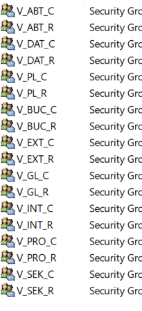

Für die Berechtigungen habe ich Gruppen erstellt, die mit *V* beginnen, und die entsprechenden Abkürzungen für die verschiedenen Abteilungen verwendet:
Daten -> DAT
Abteilung -> ABT
Pool -> PL
Buchhaltung -> BUC
Externe -> EXT
Intern -> INT
Promoter -> PRO
Sekretariat -> SEK
Geschäftsleitung -> GL

# AWS Managed AD
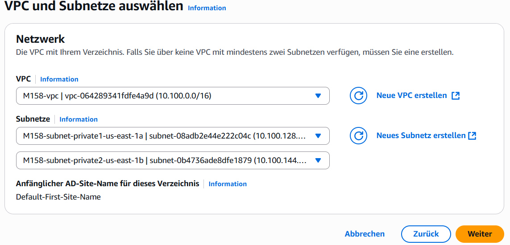

# Admin tool Center

## EC2
Die Ec2-Instanz ist mit dem AWS Managed AD verbunden.
DAher muss sie im Public Subnet sein, damit sie den AD-Server erreichen kann.
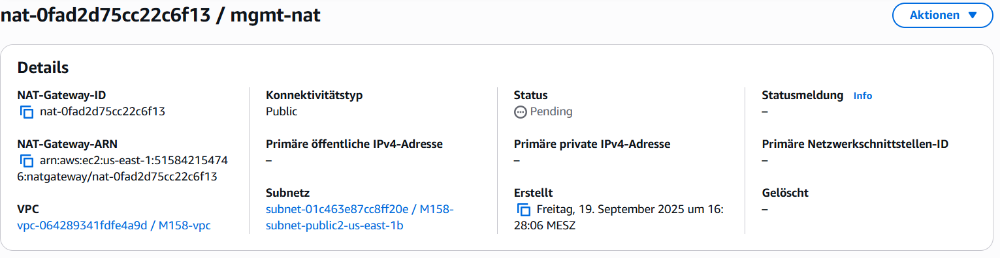

IP: 10.100.128.10
PW: 5jfbkn&q1lu0p6A%v?P8u-SOD5Ve7DUq

## NatGateway

ICh habe in der DC Sicherheits Gruppe die Ports 5985 und 5986 Freigeschaltet.

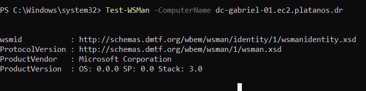

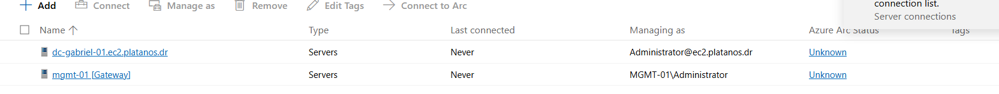

# Azure AD (Entra ID)

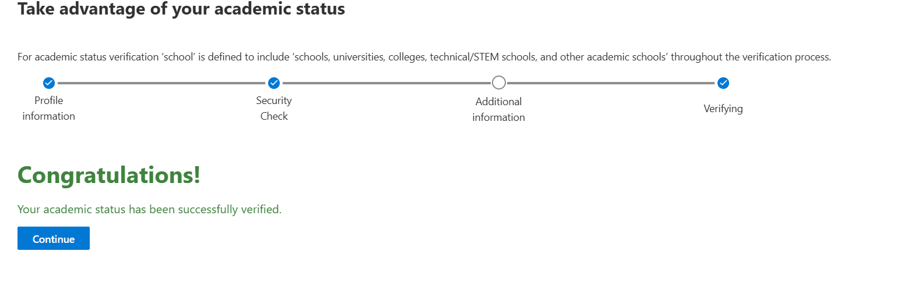

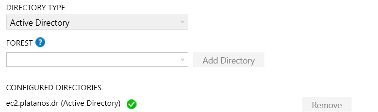

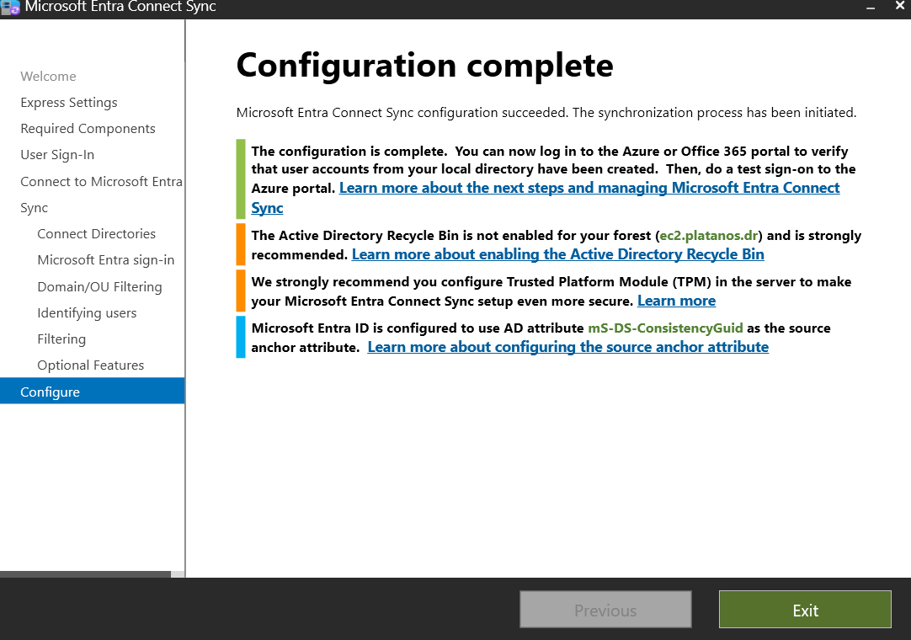

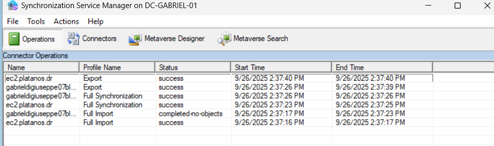

# Dynv6

pwd: bQeRTA8Yjxo1EQ_5KrhxKzVZ88xgub

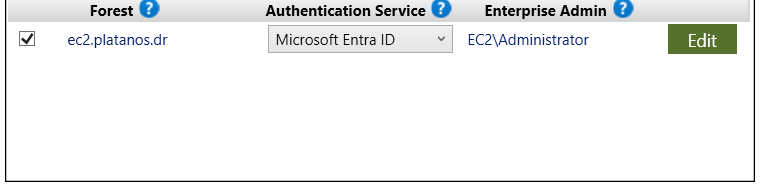

# NEW AWS LAb

DC

Adminstrator
.rx;E*eWFYkSuW0dPVNIU21@?J9Th%V7

Domain:
Platanos1!

## GPOS

### Passwort Richtlinie
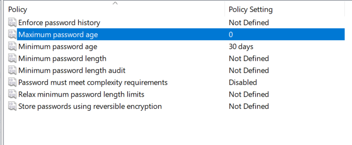
